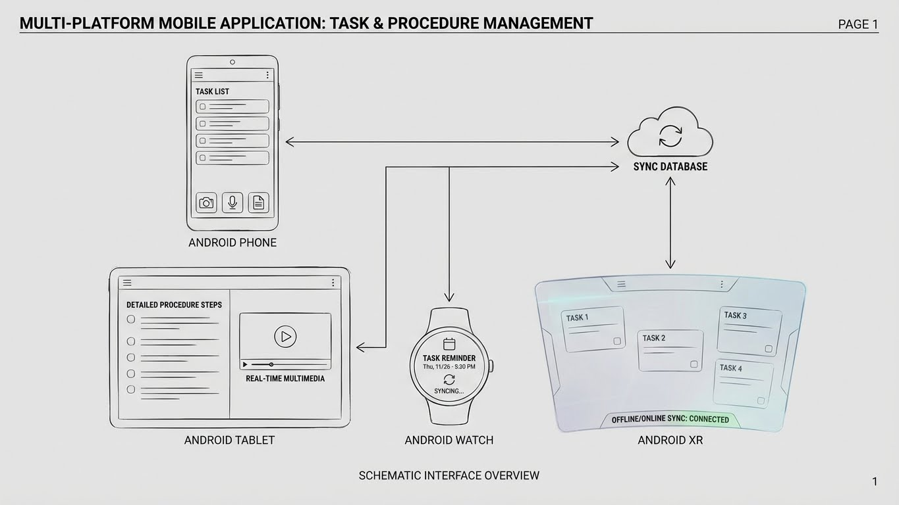

<div align="center">

# 📋 Task Manager Pro

**Sistema de gestión de tareas con documentación multimedia en tiempo real**

[](https://github.com/tu-usuario/tfg-task-manager-android)
[](https://github.com/tu-usuario/tfg-task-manager-backend)
[](https://www.mongodb.com/)
[](LICENSE)

[🎯 Características](#características) •
[📱 Android App](https://github.com/tu-usuario/tfg-task-manager-android) •
[🖥️ Backend API](https://github.com/tu-usuario/tfg-task-manager-backend) •
[📚 Documentación](#documentación) •
[🎓 TFG](#sobre-el-tfg)


[](https://youtu.be/E_2c98GBwmw)

</div>

---

## 🎯 Características

- ✅ **Gestión de tareas** con procedimientos paso a paso
- 📸 **Documentación multimedia** (fotos, audio transcrito por IA)
- 🔄 **Sincronización offline/online** automática
- 👥 **Roles diferenciados** (Admin/Worker)
- 🤖 **IA integrada** para transcripción de audio
- 📱 **Multiplataforma** (Android, Wear OS, Android XR)
- 🔐 **Segura** (autenticación)

---

## 🏗️ Arquitectura

### Repositorios del Proyecto

| Repositorio                                                                   | Descripción           | Tecnologías            |
|-------------------------------------------------------------------------------|-----------------------|------------------------|
| [📱 Android App](https://github.com/JeremiasCortes/tfg-task-manager-android)  | Aplicación móvil      | Kotlin, Compose, Realm |
| [🖥️ Backend API](https://github.com/JeremiasCortes/tfg-task-manager-backend) | API REST y servicios  | Spring Boot, MongoDB   |
| 📘 **Este repo (HUB)**                                                        | Documentación general | Markdown, Diagramas    |

---

## 📱 Android App

```bash
git clone https://github.com/JeremiasCortes/tfg-task-manager-android
cd tfg-task-manager-android
./gradlew assembleDebug
```

[Ver documentación Android →](https://github.com/JeremiasCortes/tfg-task-manager-android)

---

## 🖥️ Backend API

```bash
git clone https://github.com/JeremiasCortes/tfg-task-manager-backend
cd tfg-task-manager-backend
./mvnw spring-boot:run
```

[Ver documentación Backend →](https://github.com/JeremiasCortes/tfg-task-manager-backend)

---

## 📚 Documentación

- [📋 Requisitos del Sistema](docs/01-requisitos.md)
- [🎯 Alcance del Proyecto](docs/02-alcance.md)
- [🏗️ Arquitectura General](docs/03-arquitectura-general.md)
- [💾 Modelo de Datos](docs/04-modelo-datos.md)
- [🔧 Decisiones Técnicas](docs/05-decisiones-tecnicas.md)
- [📅 Timeline de Desarrollo](docs/06-timeline.md)
- [🚀 Manual de Despliegue](docs/07-manual-despliegue.md)

---

## 🎓 Sobre el TFG

**Trabajo de Fin de Grado Superior de Desarrollo de Aplicaciones Multiplataforma** - Sant Josep Obrer

**Autor:** Jeremías Cortés Carrasco
**Fecha:** Diciembre, 2025 - Marzo, 2026

### Memoria TFG

La memoria completa del TFG se encuentra en [`/memoria-tfg`](memoria-tfg/README.md)

---

## 🛠️ Stack Tecnológico

### Frontend (Android)

- Kotlin
- Jetpack Compose
- Realm Kotlin
- CameraX, MediaRecorder
- Retrofit

### Backend

- Spring Boot 3.2
- MongoDB Atlas + Device Sync
- OpenAI Whisper API

### DevOps

- GitHub Actions (CI/CD)
- Docker
- Firebase (Analytics, Crashlytics)

---

## 📊 Estado del Proyecto

- ✅ Fase de Diseño (Semana 1-2)
- 🔄 Desarrollo MVP (Semana 3-5)
- ⏳ Backend e IA (Semana 6-7)
- ⏳ Multimedia (Semana 8-9)
- ⏳ Pulido (Semana 10-11)
- ⏳ Testing (Semana 12)
- ⏳ Documentación Final (Semana 13)

[Ver Timeline Detallado →](docs/06-timeline.md)

---

## 🤝 Contacto

- 📧 Email: jeremiasacortes@gmail.com
- 💼 LinkedIn: https://www.linkedin.com/in/jeremias-cortes/

---

## 📄 Licencia

Este proyecto está bajo la Licencia MIT - ver [LICENSE](LICENSE) para detalles.

---

<div align="center">

**⭐ Si te gusta el proyecto, dale una estrella!**

</div>
